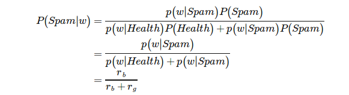

大数据算命系列（1）
===================

朴素贝叶斯算法简介与应用
~~~~~~~~~~~~~~~~~~~~~~~~

     -----  大数据算命师

     -----  2013.06.06

--------------

贝叶斯公式
==========

* 贝叶斯公式

* Paul Graham
    这种过滤器还具有自我学习的功能，会根据新收到的邮件，不断调整。收到的垃圾邮件越多，它的准确率就越高

* 分词技术
    1. 中文分词
    #. 特定的url分词

--------------

几个概率
========

* 先验概率
   在没有任何前提下， 事件A发生的概率

* 条件概率
   在条件A发生前提下， 事件A的概率

* 联合概率
   在多个事件发生的情况下，另一个事件发生概率有多大。比如，已知W1和W2是两个不同的词语，它们都出现在某封电子邮件之中，那么这封邮件是垃圾邮件的概率，就是联合概率。

--------------

* 分类
   明确把东西分几类

* 聚类
   不明确把东西分几类，看情况有多少算多少

--------------

hashtable_good
==============

.. sourcecode:: 

> db.hashtable_good.find({"prob":{"$gt":0.2}})
{ "_id" : ObjectId("5169985d8c38926a4916bc43"), "count" : 327914, "word" : ".jpg", "prob" : 0.2103063003897459 }
> db.hashtable_good.find({"prob":{"$gt":0.1}})
{ "_id" : ObjectId("5169985d8c38926a4916bc43"), "count" : 327914, "word" : ".jpg", "prob" : 0.2103063003897459 }
> db.hashtable_good.find({"prob":{"$gt":0.05}})
{ "_id" : ObjectId("5169985b8c38926a49166947"), "count" : 126709, "word" : ".gif", "prob" : 0.08126429800522184 }
{ "_id" : ObjectId("5169985b8c38926a4916718e"), "count" : 144223, "word" : ".js", "prob" : 0.09249683014787513 }
{ "_id" : ObjectId("5169985d8c38926a4916bc43"), "count" : 327914, "word" : ".jpg", "prob" : 0.2103063003897459 }
> db.hashtable_good.find({"prob":{"$gt":0.01}})
{ "_id" : ObjectId("5169985a8c38926a49165b45"), "count" : 77428, "word" : ".png", "prob" : 0.04965813056648159 }
{ "_id" : ObjectId("5169985b8c38926a49166947"), "count" : 126709, "word" : ".gif", "prob" : 0.08126429800522184 }
{ "_id" : ObjectId("5169985b8c38926a4916718e"), "count" : 144223, "word" : ".js", "prob" : 0.09249683014787513 }
{ "_id" : ObjectId("5169985c8c38926a49168cfb"), "count" : 70585, "word" : ".html", "prob" : 0.045269400553224974 }
{ "_id" : ObjectId("5169985d8c38926a4916bc43"), "count" : 327914, "word" : ".jpg", "prob" : 0.2103063003897459 }
{ "_id" : ObjectId("5169985e8c38926a4916d1d5"), "count" : 17789, "word" : ".htm", "prob" : 0.01140890226593921 }
{ "_id" : ObjectId("5169985f8c38926a4916e2cd"), "count" : 33031, "word" : ".css", "prob" : 0.021184296517299344 }
{ "_id" : ObjectId("5169985f8c38926a4916ed4b"), "count" : 19959, "word" : ".webui/", "prob" : 0.012800622875140855 }
{ "_id" : ObjectId("516998608c38926a4916fd39"), "count" : 36313, "word" : ".asp", "prob" : 0.023289193770478975 }
{ "_id" : ObjectId("516998608c38926a491704bb"), "count" : 77757, "word" : ".php", "prob" : 0.04986913336852185 }

--------------

hashtable_bad
=============

.. sourcecode:: 

> db.hashtable_bad.find({"prob":{"$gt":0.01}})
{ "_id" : ObjectId("51699a558c38926a491742fa"), "count" : 760920, "word" : "'", "prob" : 0.017638206341006112 }
{ "_id" : ObjectId("51699a558c38926a49174ab5"), "count" : 585758, "word" : "(select", "prob" : 0.013577932594615804 }
{ "_id" : ObjectId("51699a588c38926a491798ab"), "count" : 640537, "word" : "+", "prob" : 0.01484771562720001 }
{ "_id" : ObjectId("51699a5a8c38926a4917c388"), "count" : 469928, "word" : ".asp", "prob" : 0.010892980903927246 }
{ "_id" : ObjectId("51699a5d8c38926a49182b04"), "count" : 435550, "word" : "and", "prob" : 0.010096095216087383 }
{ "_id" : ObjectId("51699a5d8c38926a49182d5b"), "count" : 3861194, "word" : "/../", "prob" : 0.08950288663020389 }
{ "_id" : ObjectId("51699a5e8c38926a491842cb"), "count" : 467705, "word" : "=1", "prob" : 0.010841451528045344 }
{ "_id" : ObjectId("51699a5e8c38926a491842ce"), "count" : 679395, "word" : "=0", "prob" : 0.015748448190411407 }
{ "_id" : ObjectId("51699a658c38926a49190063"), "count" : 584303, "word" : "/js/", "prob" : 0.013544205540226164 }
{ "_id" : ObjectId("51699a668c38926a49192c94"), "count" : 475798, "word" : "),", "prob" : 0.011029048126791285 }
{ "_id" : ObjectId("51699a6a8c38926a49198d18"), "count" : 1260056, "word" : ".php", "prob" : 0.02920823178418598 }
> db.hashtable_bad.find({"prob":{"$gt":0.1}})
> db.hashtable_bad.find({"prob":{"$gt":0.05}})
{ "_id" : ObjectId("51699a5d8c38926a49182d5b"), "count" : 3861194, "word" : "/../", "prob" : 0.08950288663020389 }

----------------

hashtable_prob
==============

.. sourcecode:: 

> db.hashtable_prob.find({"prob":{"$gt":0.999}})
{ "_id" : ObjectId("516a1a9d8c3892251c895f93"), "word" : "/./", "prob" : 0.9999, "good_prob" : 6.413459028579015e-7, "bad_prob" : 0.009819255208819029 }
{ "_id" : ObjectId("516a1a9e8c3892251c897e9c"), "word" : "')", "prob" : 0.9991, "good_prob" : 0.000001282691805715803, "bad_prob" : 0.0014666748538801446 }
{ "_id" : ObjectId("516a1a9e8c3892251c8982bd"), "word" : "17,", "prob" : 0.9996, "good_prob" : 6.413459028579015e-7, "bad_prob" : 0.0016345451823267176 }
{ "_id" : ObjectId("516a1a958c3892251c887dce"), "word" : "&intro=", "prob" : 0.9996, "good_prob" : 6.413459028579015e-7, "bad_prob" : 0.0017652809807855233 }
{ "_id" : ObjectId("516a1a978c3892251c88bb6a"), "word" : "('", "prob" : 0.9991, "good_prob" : 0.000001282691805715803, "bad_prob" : 0.0013494066970710847 }
{ "_id" : ObjectId("516a1a998c3892251c88e957"), "word" : "/../", "prob" : 0.9999, "good_prob" : 0.000002565383611431606, "bad_prob" : 0.08950288663020389 }
{ "_id" : ObjectId("516a1aa18c3892251c89baf8"), "word" : "=88888", "prob" : 0.9991, "good_prob" : 6.413459028579015e-7, "bad_prob" : 0.000690720801857357 }
{ "_id" : ObjectId("516a1aa48c3892251c8a19ee"), "word" : "(1)", "prob" : 0.9996, "good_prob" : 6.413459028579015e-7, "bad_prob" : 0.0015655148263319792 }
{ "_id" : ObjectId("516a1aa78c3892251c8a6f70"), "word" : "6,", "prob" : 0.9994, "good_prob" : 0.000001282691805715803, "bad_prob" : 0.002322947973573103 }
{ "_id" : ObjectId("516a1aab8c3892251c8ac722"), "word" : "&goods_type=", "prob" : 0.9996, "good_prob" : 6.413459028579015e-7, "bad_prob" : 0.0016261539839149998 }
{ "_id" : ObjectId("516a1aad8c3892251c8b07d8"), "word" : "=3232", "prob" : 0.9992, "good_prob" : 6.413459028579015e-7, "bad_prob" : 0.0007740069231095714 }
{ "_id" : ObjectId("516a1aae8c3892251c8b1510"), "word" : ")+", "prob" : 0.9997, "good_prob" : 6.413459028579015e-7, "bad_prob" : 0.0020395711763818085 }
{ "_id" : ObjectId("516a1aaf8c3892251c8b2afa"), "word" : "1,", "prob" : 0.9998, "good_prob" : 0.000001282691805715803, "bad_prob" : 0.005352008339460415 }
{ "_id" : ObjectId("516a1aaf8c3892251c8b3593"), "word" : "5,", "prob" : 0.9997, "good_prob" : 0.000001282691805715803, "bad_prob" : 0.0038790053166123176 }

-------------------------

Paul Graham的计算公式假设
~~~~~~~~~~~~~~~~~~~~~~~~~

1. 在样本中，如果某个词只出现在垃圾邮件中，它在正常邮件的出现频率是1%，反之亦然。这里Paul Grahm认为有改善的空间。

2. 假定垃圾邮件的"先验概率"为50%。文中的样本也是由4000份垃圾邮件和4000份正常邮件组成。

3. 如果有的词是第一次出现，无法计算P(S|W)，就假定这个值等于0.4。

--------------

概率公式
========

条件概率：
~~~~~~~~~~

.. sourcecode:: python

    prob[k]["good_prob"] = good_prob
    prob[k]["bad_prob"] = bad_prob
    prob[k]["prob"] = bad_prob/(good_prob+bad_prob)

联合概率：
~~~~~~~~~~

.. sourcecode:: python

    # 复合概率公式
    #                          P1*P2*P3*...*Pn
    # P = -----------------------------------------------------------
    #       (P1*P2*P3*...*Pn + (1-P1)*(1-P2)*(1-P3)*...*(1-Pn))

    # mutil_prob: P1*P2*P3*...*Pn
    # onesub_muti_prob: (1-P1)*(1-P2)*(1-P3)*...*(1-Pn)

    mutil_prob = 1
    onesub_muti_prob = 1
    for w in words:
        prob = prob_dict[w]["prob"]
        print "[%s] [%s]" % (w, prob, )
        mutil_prob *= prob
        onesub_muti_prob *= (1-prob)

    attack_probability = mutil_prob/(mutil_prob + onesub_muti_prob)

    return attack_probability

--------------

url分词研究
===========

原则
~~~~

1. 只按空格进行分割。
#. 最后的多个空格，进行压缩后只需要一个空格。
#. 要实现攻击的目的，必须要使用特殊符号，关键字，函数名。
#. 特殊符号能非常有效的匹配正常请求与攻击请求。

分割技术
~~~~~~~~

1. 将所有的特殊符号替换为： 空格+特殊符号+空格
#. 部分
#. 将部分符号由1变成2, 这样可以将符号往前面都靠上去
#. 符号集 / ( ) . =
#. / 主要代表了路径
#. ( ) 通常是和函数一起
#. . 按文件名与文件后缀进行侵害
#. = 变量名，变量值
#. 将部分符号只往左靠才有意义
如： > ,
script>
select null,1,3,5,
1>2  # 大于符号要算例外 
部分符号只往右靠才有意义
& ? @ <

#. 小于符号算例外
如：
@@version
?id=
&cm=
<script

#. 要解决，被同时向右靠和同时向左靠

[Access] [/one.php?id=1&uid=3.php;.jpg]

[Split]  / /one. .php ?id= =1 &uid= =3. .php ;. .jpg

其中的=3.这个分词，3就是被向右靠的=与向左千的.

#. 将有意义的符号组合拼接起来

/**/# sql注释

--$# sql注释

/../ # 目录跳转

http:// # http网站，远程包含，url跳转

--------------

一个命题
~~~~~~~~

如果你的过滤器效果越好，就越不能出现误判，一旦误判，后果就会变得很严重。

类似于：富人越富，穷人越穷

--------------

Thank you!
==========
