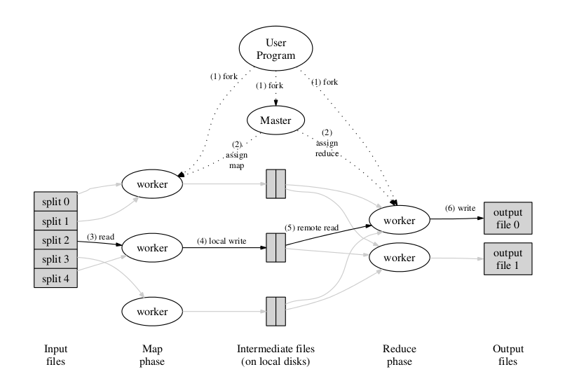

大数据算命系列(2)
=================

map-reduce计算框架介绍
~~~~~~~~~~~~~~~~~~~~~~

  ----- 大数据算命师

  ----- 2013.06.25

--------------------------------------------------------------------------------

要点
====

1. google map-reduce介绍
#. map函数与reduce函数
#. 大文件分治处理
#. mapper.py与reducer.py
#. bash模拟
#. map-reduce流程
#. hadoop streaming

--------------------------------------------------------------------------------

Simplified Data Processing on Large Clusters
============================================

1. 一句话

   i. Our abstraction is inspired by the map and reduce primitives present in Lisp and many other functional languages.
   #. 我们的灵感来自lisp和其他函数式编程语言中的古老的映射和化简操作

#. 两个概念

   i. map： 映射
   #. reduce: 化简

#. 两个模拟程序

   i. distributed grep
   #. distributed sort

--------------------------------------------------------------------------------

map与reduce函数
===============

1. 来自于Lisp语言，python中也有

#. 任务：求数组 [1, 8, 9, 20, 3, 9] 每个元素的平方和

lisp版本:

.. code-block:: cl

   (setq mapout
   (map 'vector #'(lambda (x)
                    (* x x))
        (list 1 8 9 20 3 9))
   )

   (reduce  #'+ mapout)

python版本:

.. code-block:: python

   ldemo = [1, 8, 9, 20, 3, 9]
   mapout = map(lambda x: x**2,  ldemo)
   reduceout = reduce(lambda x, y: x+y, mapout)
   print type(mapout), type(reduceout), reduceout

--------------------------------------------------------------------------------

大文件分治处理
==============

任务:现有一日志文件，10T，需要求出访问加速乐最多的10个ip地址，假定ip地址为第5个字段，且不同ip地址共有1千万个, 内存占用不能超过4G

1. 传统命令行版本

.. code-block:: bash

   awk '{ips[$5]++}END{for( i in ips){print i, ips[i]}' | sort -k2 -nr | head

2. 分治
    
分治为: 10*1024/2 = 5120个文件, hash(ip) mod 5120 发到文件(原则：同一ip到同一文件)

0001_1.ip 0002_1.ip 0003_1.ip ... 5119.ip
    
3. 归并::

   0001_1.ip top 10 ip
   0002_1.ip top 10 ip
   0002_2.ip top 10 ip
   ...
   5119_1.ip top 10 ip

归并排序: 最后的top10 ip

--------------------------------------------------------------------------------

mapper.py
=========

.. code-block:: python

   import sys
   for line in sys.stdin:
       line = line.strip()
       words = line.split()
       for word in words:
           print '%s\t%s' % (word, 1)

--------------------------------------------------------------------------------

reducer.py
==========

.. code-block:: python

   import sys
   current_word = None
   current_count = 0
   word = None
   for line in sys.stdin:
       line = line.strip()
       word, count = line.split('\t', 1)
       try:
           count = int(count)
       except ValueError:
           continue
       if current_word == word:
           current_count += count
       else:
           if current_word:
               # write result to STDOUT
               print '%s\t%s' % (current_word, current_count)
           current_count = count
           current_word = word
   if current_word == word:
       print '%s\t%s' % (current_word, current_count)

--------------------------------------------------------------------------------

bash模拟
========

.. code-block:: bash

   cat joy.ncsa | mapper/mapper.py | sort | reducer/reducer.py

注意：
   1. 需要排序
   #. 没有combiner
   #. 没有真正并行

--------------------------------------------------------------------------------

mapreduce流程图
===============

--------------------------------------------------------------------------------

hadoop streaming
================

.. code-block:: bash

   STREAM=/usr/share/dse/hadoop/lib/hadoop-streaming-1.0.4.2.jar
   mapper=${ROOT_DIR}/mapper/mapper.py
   reducer=${ROOT_DIR}/reducer/reducer.py
   combiner=${ROOT_DIR}/reducer/reducer.py

   access_gz=/access/${YESTERDAY}/*.ncsa.gz
   attack_gz=/attack/${YESTERDAY}/*.ncsa.gz

   hadoop jar $STREAM -input ${access_gz} -input ${attack_gz} \
       -output ${out} \
       -file ${mapper} \
       -file ${reducer}  \
       -mapper ${mapper} \
       -combiner ${combiner} \
       -reducer ${reducer} \
       -jobconf stream.recordreader.compression=gzip

数据流程：

Input ====> map ====>（combine）====> partition ====> copy&merge ====> sort ====> reduce ====> output

--------------------------------------------------------------------------------

python map-red
==============

1. mincemeat

#. dumbo

#. discoproject

#. mrjob

#. hadoopy

--------------------------------------------------------------------------------

Thank you!
==========
